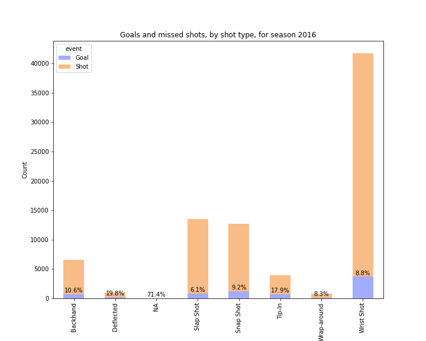

# Hockey Primer Data Exploration


Table of contents
=================

<!--ts-->
   * [Introduction](#introduction)
     * [About](#about)
     * [Motivation](#motivation)
   * [Installation](#installation)
      * [Setup Environment](#setup-environment)
      * [Install Dependencies](#install-dependencies)
      * [Download Data](#download-data)
   * [Project Structure](#project-structure)

   * [Data Insights](#dependency)
     * [Data Extractions](#docker)
     * [Interactive Debugging Tool](#docker)
     * [Simple Visualisation](#local)
     * [Advance Visualisation](#public)

   * [Conclusion](#conclusion)
   * [Authors](#authors)
<!--te-->

# Introduction

To be udpated

## About NHL

To be udpated

## Motivation

To be udpated

# Installation

## Setting up Environment
- Git clone the [repository](git@github.com:amandalmia14/hockey-primer-1.git)
- Make sure Python is installed on the system
- Create a virtual environment / conda environment

## Installing Dependencies
- Activate the environment and run `pip install -r requirement.txt`

## Download Data
- The data for the NHL games are exposed out in the form of various APIs, the details of the APIs can be found over 
[here](https://gitlab.com/dword4/nhlapi)
- Run the python script which resides at `modules/data_extraction.py`, this script will fetches the data of the seasons
starting from 2016 to 2020. 


# Project Structure

As seen the above image, the project is divided into various parts, 
- `data` - It contains all the NHL tournament data season wise, in each season we have two json files of regular season 
game and playoffs. 
- `modules` - For every actions which we are performing in this project, are been captured as modules, like data 
extractions, data retrival (data parsing)
- `notebooks` - For all kinds of visualisations, insights of the data can be accessed through the notebooks. 
- `constants.py` - As name suggested, all the common functions and variables reside in this file.

# Data Insights

<details>
<summary>Goals By Season for the season 2020</summary>
     <h4>Insights</h4>
     To be add here. 
     
</details>

## Data Extractions

<details>
<summary>Tidy Data</summary>
     <h4>Insights</h4>
     There are too much of information available from the NHL API at this moment not all informations are useful, based 
     on the project we take the relevant data out from the nested json and created a single tabular structure aka
     Dataframe. Below is a glimpse of the tody data which we extracted. 

     ```
     TODO
     Discuss how you could add the actual strength information (i.e. 5 on 4, etc.) to both shots and goals, given the 
     other event types (beyond just shots and goals) and features available.
     In a few sentences, discuss at least 3 additional features you could consider creating from the data available in 
     this dataset. We’re not looking for any particular answers, but if you need some inspiration, could a shot or 
     goal be classified as a rebound/shot off the rush (explain how you’d determine these!)
     ```


</details>


## Interactive Debugging Tool

<details>
<summary>Goals By Season for the season 2020</summary>
     <h4>Insights</h4>
     To be add here. 
     
</details>


## Simple Visualisations

<details>
<summary>Goals By Season for the season 2016</summary>
     <h4>Insights</h4>
     To be add here.   
     
</details>

<details>
<summary>Goals By Season for the season 2018</summary>
     <h4>Insights</h4>
     To be add here. 
     
</details>

<details>
<summary>Goals By Season for the season 2019</summary>
     <h4>Insights</h4>
     To be add here. 
     
</details>

<details>
<summary>Goals By Season for the season 2020</summary>
     <h4>Insights</h4>
     To be add here. 
     
</details>

<details>
<summary>Goals By Distance and Shot type for the season 2017</summary>
     <h4>Insights</h4>
     To be add here. 
     
</details>

## Advance Visualisations 

<details>
<summary>Details</summary>
     <h4>Insights</h4>
     To be add here. 
     
</details>

# Conclusion

To be udpated

# Authors
- ABC 
- DEF
- GHI
- JKL


