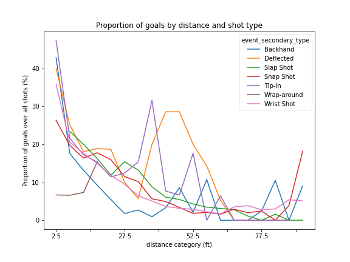
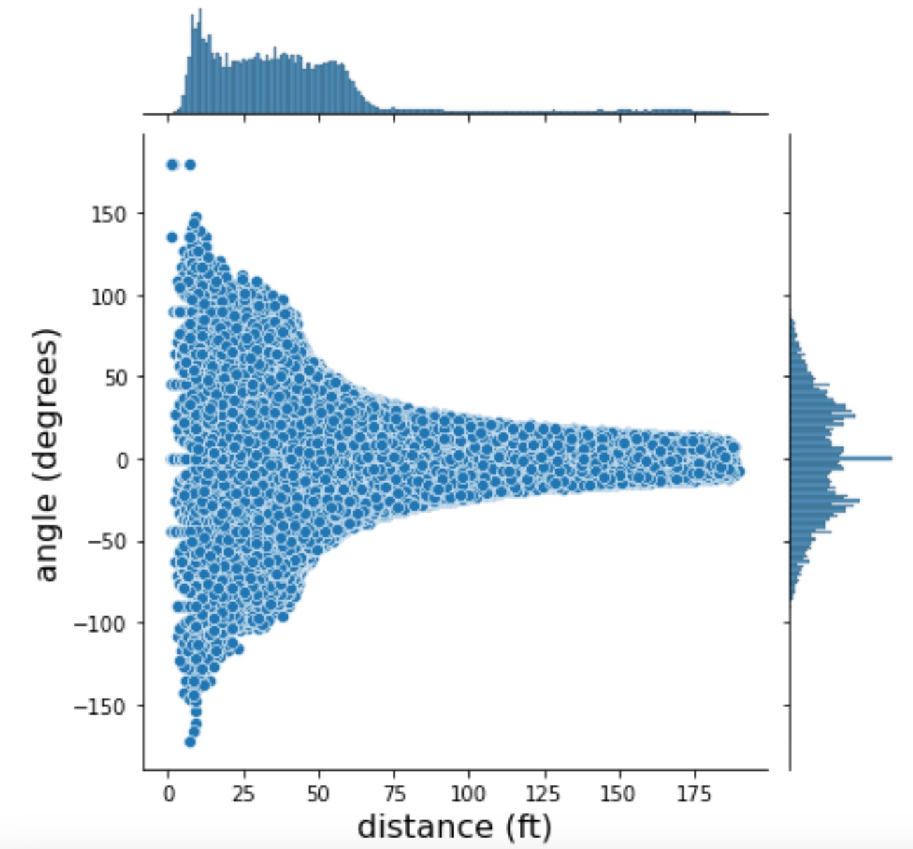

# Hockey Primer Data Exploration


Table of contents
=================

<!--ts-->

* [Introduction](#introduction)
    * [Motivation](#motivation)
* [Installation](#installation)
    * [Setup Environment](#setup-environment)
    * [Install Dependencies](#install-dependencies)
* [Usage](#usage)
  * Milestone 1
      * [Download Data](#download-data)
      * [Run Interactive Debugging Tool](#run-interactive-debugging-tool)
      * [Create Tidy Data for Visualisation](#create-tidy-data-for-visualisation)
      * [Run Simple Visualisation](#run-simple-visualisation)
      * [Run Advance Visualisation](#run-advance-visualisation)
  * Milestone 2
      * [Experiment Tracking](#download-data)
      * [Run Extracting Feature Engineering I and II](#run-interactive-debugging-tool)
      * [Experiments on Baseline Models](#create-tidy-data-for-visualisation)
      * [Experiments on Baseline Models](#run-simple-visualisation)
      * [Best Shot Models](#run-advance-visualisation)
      * [Run Final Evaluation on Test Data](#run-advance-visualisation)
* [Project Structure](#project-structure)
* [Data APIs](#data-apis)
* [Data Insights](#data-insights)
  * Milestone 1
      * [Data Extractions](#data-extractions)
      * [Interactive Debugging Tool](#interactive-debugging-tool)
      * [Simple Visualisation](#simple-visualisations)
      * [Advanced Visualisation](#advanced-visualisations)
  * Milestone 2
      * [Experiment Tracking](#data-extractions)
      * [Feature Engineering I](#interactive-debugging-tool)
      * [Baseline Models](#simple-visualisations)
      * [Feature Engineering II]()
      * [Advanced Models](#advanced-visualisations)
      * [Best Shot Models](#advanced-visualisations)
      * [Evaluate on Test Set](#advanced-visualisations)

* [Conclusion](#conclusion)
* [Authors](#authors)

<!--te-->

# Introduction

The National Hockey League (NHL) is a professional ice hockey league in North America. It comprises a total of 32 teams, of which 7 in Canada [EPL](https://en.wikipedia.org/wiki/National_Hockey_League), including the Montreal Canadien. Each year, the Stanley Cup playoffs select the best team, which is awarded the Stanley Cup for the season. For example, The Montreal Canadien won the Stanley Cup 24 for 24 seasons, the last time in 1992-1993. 

The NHL makes publically available an API that features statistics including meta-data on each season, season standings, player statistics by season, and play-by-play data. This last format of data is the most thorough and it features important information for all events during each game, such as the players involved, location coordinates on the ice, and the type of event. The NHL API is a valuable source of fine-grained sports data that can be used in several tasks such as finding the features that predict goals, or those that predict players' salaries. 


## Motivation

The purpose of this project is to provide a Python API for accessing NHL data, specifically, all the play-by-play information. The reader will learn here how to download the NHL data for a given year, how to first visualize it, and then how to format it into a tidy data frame. This tidy data format will then be used for producing simple, as well as more advanced, interactive visualizations. In terms, of this data could also be used for several purposes including machine learning, or other tasks at the reader's will. 

# Installation

## Setup Environment

- Git clone the [repository](https://github.com/amandalmia14/hockey-primer-1)
- Make sure Python is installed on the system
- Create a virtual environment / conda environment
  - Create a "configfile.ini" which will store all the configurations of "Comet ML",
  - Get the API key from the Comet ML platform and update the `configfile.ini`
    ```commandline
    [comet_ml_prod]
    api_key=YOUR API KEY
    project_name_distance=logistic-regression-distance
    project_name_angle=logistic-regression-angle
    project_name_distance_angle=logistic-regression-distance-angle
    project_name_random_baseline=random-baseline
    project_name_baseline=baseline-models
    project_name_best_shot=bestshot-models
    project_name_final_test_playoffs=project_name_final_test_playoffs
    project_name_final_test_regular=project_name_final_test_regular
    workspace=data-science-workspace
    ```

## Install Dependencies

- Activate the environment and run `pip install -r requirement.txt` this will download all the dependencies related to
  this project.

# Usage

## Milestone 1
### Download Data
- The data for the NHL games are exposed in the form of various APIs, the details of the APIs can be found over
  [here](https://gitlab.com/dword4/nhlapi)
- Run the python script which resides at `modules/dataextraction/data_extraction.py`, this script will fetch the data 
of the seasons starting from 2016 to 2020.
- This will create a folder in your directory for the season that you want to download and two JSON files will be 
appeared along with some other files which will be used later part of the project.  
  - `YYYY_regular_season.json`
  - `YYYY_playoffs.json`
  
  <br>
  
  <br>

### Run Interactive Debugging Tool
- Run the `jupyter notebook` locally inside the project folder
- Navigate to the `notebook` folder 
- Run `3_interactive_debugging_tool.ipynb` file

### Create Tidy Data for Visualisation
- Run the python script which resides at `modules/dataretrival/data_retrival.py`, this script will create the tidy data 
and save the data into a pickle file for all the seasons starting from 2016 to 2020.

### Run Simple Visualisation
- Run the `jupyter notebook` locally inside the project folder (Incase if jupyter notebook isn't running)
- Navigate to the `notebook` folder 
- Run `4_simple_visualizations.ipynb` file

### Run Advance Visualisation
- Run the `jupyter notebook` locally inside the project folder (Incase if jupyter notebook isn't running)
- Navigate to the `notebook` folder 
- Run `7_interactive_figure.ipynb` file

## Milestone 2

### Experiment Tracking
- We have used comet-ml academic version platform to log our various metrics, data, models and other 
  artifacts which will help us to keep track of the model's performance. 
- We have created multiple projects for various given tasks such as,
  - [Feature Engineering I](https://www.comet.com/data-science-workspace/feature-engineering/view/new/panels)
  - [Baseline Models](https://www.comet.com/data-science-workspace/baseline-models/view/new/panels)
  - [Feature Selection](https://www.comet.com/data-science-workspace/feature-selection/view/new/panels)
  - [Advanced Models](https://www.comet.com/data-science-workspace/advanced-models/view/new/panels)
  - [Best Shot Models](https://www.comet.com/data-science-workspace/bestshot-models/view/new/panels)
  - [Final Test on Playoffs game](https://www.comet.com/data-science-workspace/project-name-final-test-playoffs/view/new/panels)
  - [Final Test on Regular Games](https://www.comet.com/data-science-workspace/project-name-final-test-regular/view/new/panels)

### Feature Engineering I
  - Run the `jupyter notebook` locally inside the project folder (Incase if jupyter notebook isn't running)
  - Navigate to the `notebook` folder 
  - Run `8_feature_engineering_I_and_II_m2.ipynb` file to see in the interactive mode else 
  - Run `8_feature_engineering_I_and_II_m2.py` as a standalone code as well. 

### Baseline Models
  - Run the `jupyter notebook` locally inside the project folder (Incase if jupyter notebook isn't running)
  - Navigate to the `notebook` folder 
  - Run `9_baseline_models_all.ipynb` file to see in the interactive mode else 
  - Run `q6_best_shot_all.py` as a standalone code as well. 

### Advanced Models
  - Run the `jupyter notebook` locally inside the project folder (Incase if jupyter notebook isn't running)
  - Navigate to the `notebook` folder 
  - Run `10_advanced_models.ipynb` file to see in the interactive mode else 
  - Run `advanced_models.py` as a standalone code as well. 
### Best Shot Models
  - Run the `jupyter notebook` locally inside the project folder (Incase if jupyter notebook isn't running)
  - Navigate to the `notebook` folder 
  - Run `11_best_shot_all.ipynb` file to see in the interactive mode else 
  - Run `q6_best_shot_all.py` as a standalone code as well. 
### Evaluate on Test Set
  - Run the `jupyter notebook` locally inside the project folder (Incase if jupyter notebook isn't running)
  - Navigate to the `notebook` folder 
  - Run `12_Final_Evaluation_Testing_playoffs.ipynb` file to see in the interactive mode else 
  - Run `12_Final_Evaluation_Testing_regular.ipynb` file to see in the interactive mode else
  - Run `q7_final_evaluation_playoffs.py` as a standalone code as well. 
  - Run `q7_final_evaluation_testing_regular.py` as a standalone code as well. 

# Project Structure

As seen in the above image, the project is divided into various parts,

- `data` - It contains all the NHL tournament data season-wise, in each season we have two JSON files of the regular season
  games and playoffs.
- `figures` - These contain all the data insights which we captured in this project. 
- `modules` - For every action, we are performing in this project, are captured as modules, like data
  extractions, data retrieval (data parsing)
  - All the python codes for the Milestones 2 resides under the `milestone2` folder
- `notebooks` - For all kinds of visualizations, insights of the data can be accessed through the notebooks.
- `constants.py` - As the name suggests, all the common functions and variables reside in this file.

# Data APIs

This project uses two APIs which were provided by the NHL : 

- `GET_ALL_MATCHES_FOR_A_GIVEN_SEASON = "https://statsapi.web.nhl.com/api/v1/schedule?season=XXXX"`
    - This API fetches all the matches metadata for a given input season, using this API we are getting the map of
      Matches ID and the type of Match it is like `regular season or playoffs
- `GET_ALL_DATA_FOR_A_GIVEN_MATCH = "https://statsapi.web.nhl.com/api/v1/game/XXXXXXXXXX/feed/live/"`
    - This API fetches all the data in a granular form for a given match id, where we gather the insights subsequently
      in
      the following tasks.
- To download a particular data for a season, update the file `modules\dataextraction\data_extraction.py` with
  the `year` variable (one can put multiple seasons to download as well)
- Once the update is done, run `data_extraction.py` it will download the data and place it under a folder with the
  season
  the year with two JSON files, with regular season games and playoffs respectively.

# Data Insights

## Milestone 2
### Data Extractions

The data available by the NHL API needs to be parsed and formatted to make more advanced data usage possible. In this regard, we select the relevant data out from the nested dictionaries from the JSON file, and we format a single tabular structure, i.e. 
 a data frame. Below is a glimpse of the tidy data frame that will be used in further analyses. 

<details>
<summary>Tidy Data</summary>

</details>

<h3>How to get the number of players in each team</h3> 
The first step would be to format a new tidy dataframe which would include all types of events (not only the shots and goals, such as in the dataframe featured above), with events as rows and including datetime, eventType, periodType, penaltySeverity, penaltyMinutes, and team, as columns. The events would to be sorted in order of their occurrence in time during the game (datetime).

We would then create an empty (np.nan) column for the number of players on the ice, and program a loop to iterate over all events while concatenating a list of player counts for each time, n_1 and n_2. At the beginning of the loop, and the beginning of each period
(each time the period of the event is not the same as the previous event), we re-initiate the parameters: n_1 = 6 (number of players in the first team, including the goalie), n_2 = 6 (number of players in the second team, including the goalie).

Eight parameters would be set: penalty_player_A_team_1=None, end_time_of_penalty_for_player_A_team_1 = Datetime penalty_player_B_team_1 = None, and end_time_of_penalty_for_player_B_team_1=Datetime (as there can be a maximum of 2 players in a penalty at the same time); and the four equivalent parameters for team 2. 

Then, as the loop iterator over all events, each time the eventTypeId == "PENALTY", if "penaltySeverity": "Minor" or "DoubleMinor", the number of players in the team involved in the penalty (Team of the player that is penalized) would be subtracted 1, the penalty_player would be set to the name the penalized player, and end_time_of_penalty parameter would be set to DateTime + penaltyMinutes. For subsequent events, as long as the penalty_player is not None, the datetime of the event would be compared to end_time_of_penalty, until datetime > end_time_of_penalty and then the number of players for that team would be added +1, as the player is back on ice.

Note that for other types of penalty (e.g. misconduct), the number of players on the ice would not be updated as an immediate player replacement is allowed.

<h3>Engineering additionnal features </h3>
We would be interested in studying the impact of tackling and hitting on the chance of goals, both (1) at team-level (2 variables), (2) player-level (4 variables), and (3) total through the game (4 variables). Indeed, tackling and hitting have become an important part of hockey, often discussed by commentators, and highly represented in the data under "eventTypeId": "HIT". 

(1) We would first extract, for each shot event, variables at team-level that corresponds to the time (in minutes) between the shot and the last time a player of the team on which the shot was taken was hit. This would be done by iterating through all events in chronological order, initiating the time at as NaN at the beginning of each period, and updating the time at each time a hit happens, for each team. This would result in variables: time_since_last_hit_team_1 and time_since_last_hit_team_2. 

(2) Additionally, during the same iteration process, we would update four boolean variables with player-level information to note whether the hitter and the hittee from the last hit event were among the player involved in the shot (shooter, goalie or assist). This would result in variables: hitter_involved_team_1, hittee_involved_team_1, hitter_involved_team_2, hittee_involved_team_2. 

(3) Finally, to study the relationship between goals and the total number of hits in a game, we would extract 4 variables, during the same iteration process as above. These variables would be initiated at 0 at the beginning of the game, and updated at each hit event for each team and type of player involved (hitter or hittee). This would result in variables: n_hitter_team_1, n_hittee_team_1, n_hitter_team_2, n_hittee_team_2.

### Interactive Debugging Tool

<details>
<summary>Event locations</summary>
     <h4>Visualize coordinates of events, by regular season or playoffs</h4>
     
</details>

### Simple Visualisations

<details>
<summary>Goals and missed shots, by shot type for season 2016-2017</summary>
     <h4>Insights</h4>
     The most dangerous types of shots for this 2016-2017 season are “deflected” (19.8% of success) followed by 
     “tip-in” shots (17.9% of success). By “most dangerous”, we mean that these shots are the ones that end up the most 
     frequently with a successful goal, as opposed to being missed. However, these are among the less frequent ones: 
     there were only 806 “deflected” and 3,267 “tip-in” shots this season. On the contrary, the most common type of 
     shot was by far the “wrist shot”, with a total of 38,056 shots of that type for this season.
     <br>
     <br>
     We chose to illustrate this question with a barplot while overlaying the count of goals in blue overtop the total 
     count of shots in orange (thus, the total of both goals and other, missed shots), by type of shot. Even though there 
     is a large difference between the most common and less common types of shots, we chose to plot the absolute numbers
     and keep the scale linear, because these are the most intuitive for the reader to understand the scale 
     (the great number of goals involved in the same season) and not to be confused with too many percentages on the same 
     figure. We chose to add annotations on top of bars for the percentage of goals overall shots because 
     these proportions could not be visually abstracted simply from the figure, and this was an intuitive way to 
     illustrate them.
     
</details>

<details>
<summary>Proportion of goal by distance for seasons 2018, 2019, 2020</summary>
     <h4>Insights</h4>
     The proportion of goals overall shots increases overall exponentially as the distance diminishes, with a maximum 
     the proportion of goals >25% when goals are shot at less than 5 feet from the goal. We also note a small, local maximum
     at 75 to 80 feet. This distribution did not change significantly for seasons 2018-19 to 2020-21. This local 
     the maximum could suggest that there is another variable (e.g. shot type or other) that could underlie this 
     distribution. 
     <br>
     
</details>

<details>
<summary>Proportion of goal by distance and shot type</summary>
     <h4>Insights</h4>
     We chose this figure after having considered and visualized different types of figures. First, we visualized 
     violin plots of the distribution of goals and missed shots; however, these did not intuitively represent the 
     chance (proportion) of goals overall shots per se, and the result was dependent on some assumption on the kernel 
     size. We also experimented with computing a logistic regression to predict goals from the distance category, which 
     worked fine.
     <br>
     Finally, we chose to come back to the most simple and intuitive method, which is to bin the distance into 
     categories and plot the proportion of goals for each bin. We chose to divide the distance into equal bins (as 
     opposed to percentiles or another kind of distribution), to be able to draw a direct conclusion about the 
     relationship of goals to the absolute value of distance by visualizing the figure. Overall, the most dangerous \
     type of shot is the “tip-in” shot taken at a distance of fewer than 5 feet, followed closely by “back-hand” 
     shots: more than 40% of these shots result in a goal. The relationship found in the previous questions, i.e. that 
     the probability of a goal augments exponentially as the distance decreases, holds true overall for most types of 
     shots. However, the “deflected” and “tip-in” shots have a second maximum between around 30 and 60 feet.
     <br>
     Importantly, the “back-hand” shot has a second maximum at about 80 feet, and the slap-shot has a second maximum at 
     more than 90 feet. This could explain the small local maximum at that distance that we observed in the global 
     distribution of all shots in the previous figure.
     <br>
     Finally, the curves are somewhat irregular, and adding more data (e.g. averaging through a few years) could add 
     more smoothness to the results. Note that to have more smoothed curves and remove outliers that made interpretations difficult, we did not plot the 
     points for which we had less than 10 total observations for that type of shot and at that distance in that season. 
     <br>
     
</details>

### Advanced Visualisations

<details>
<summary>Comparison of Colorado Avalanche avg shots between season 2016-2017 and 2020-2021  </summary>
     <h4>Insights</h4>
     To be added here. 
     <br>
     
      
</details>
<details>
<summary>Shots location comparison over the last three years in between Buffalo Sabres and Tampa Bay Lightning</summary>
     <h4>Insights</h4>
     Season 2018-2019 
     <br>
     
     
     <br>
     <h4>Insights</h4>
     Season 2018-2019 
     <br>
     
     
     <br>
     <h4>Insights</h4>
     Season 2018-2019 
     <br>
     
     
     <br>
</details>

## Milestone 2

### Experiment Tracking
<details>
<summary>All the following experiments were carefully tracked using Comet ML. This is an important step that we took to make our experiments reproducible.</summary>
     
</details>

### Feature Engineering I
<details>
<summary>Goal Rate as a function of dictance</summary>
     First, there is a relationship between the distance and the probability of a goal, such as the probability of a 
      goal is inversely proportional to distance when distance is less than approximately 60 ft.
     <br>
     Second, there is some (stochastic) probability of a goal with shots taken at approximately more than 60 feet which 
     can be in some cases higher than for goals taken at about 60 feet.
     <br>
     
     <br>
     
     <br>
</details>
<details>
<summary>Goal Rate as a function of Angle</summary>
     First, there is slightly more chance that a goal results in a goal when it is taken from in front of the goal, but 
     only when the shot is taken at less than 90 degrees.
     <br>
     Second, even though shots taken from in front of the goal (i.e. at an angle close to zero) are the most common, 
     these are not the most successful in achieving a goal. In fact, the likelihood of a goal increases as a proportion 
     to the angle, specifically when the angle is greater than approximately 90 degrees. 
     <br>
     Third and very importantly, the distribution is symmetric only in its middle part. There is a very clear asymmetry 
     when comparing the extremities of the distribution. Specifically, shots taken at very high angles (approximately 
     more than 150 degrees) are more likely to achieve a goal when taken from the side which corresponds to the 
     right-hand side of the goalie. We need to bear in mind that most goalies are right-handed and hold their hockey 
     sticks on the left side as all other players, and therefore their right side is relatively unprotected. This might 
     explain why shots taken from the far-right-hand side of the goalie are much more likely to result in a goal.
     <br>
     
     <br>
     <h4>Goal rate as a function of dictance</h4>
     The distribution is coherent with domain-specific knowledge (i.e. that “it is incredibly rare to score a 
     non-empty net goal on the opposing team from within your defensive zone”). Indeed, few successful goals (in total, 
     795 goals for the complete seasons involved) were shot from more than 89 feet. Based on this, it seems that the 
     features are correct, and we cannot find any events that have incorrect features.
     <br>
     Note: Here, we indicate the approximate defense zone by a red shade, from 89 feet from the goal up to 180 feet. 
     This is an approximation because distance is measured from the goal and thus is not always calculated 
     perpendicular to the central line.
     <br>
</details>
<details>
<summary>Goal Rate as a function of Angle and Distance</summary>
     
</details>

### Baseline Models
<details>
<summary>Receiver Operating Characteristic (ROC) curves and the AUC metric</summary>
      The accuracy is 90% correctly predicted as compared total. However, accuracy is not right metric to use in this 
      setting because there is a hight imbalance between goals and missed shots, in the order of 1:10. Indeed, we can 
      see that from the classificatinon report its clear that all the test data (validation data) has been predicted to 
      be 0s (missed shots) as the output. Therefore, even thouth this model achieved 90% accuracy, it was not 
      successful in predicting any goal. This is why accuracy is not the correct metric, and other metrics like ROC AUC 
      should be used.
      <br>
      The model based on both distance and angle (distance_angle) and that based on distance alone (distance) are the 
      two best models when considering the ROC AUC. Indeed, their area under the curve is the largest one (0.67964).
      In comparison, the two other models (random_base_line and the angle ones) are not distinguishable from random 
      results, i.e. their ROC curve follows closely the bisector line.
      <br>
     
</details>

<details>
<summary>Goal Rate </summary>
      As expected, the highest percentiles observations (the observations that have the highest predicted probability of
      being a goal) have the highest proportion of goals; however only for the distance_angle and distance_models. More 
      specifically, the proportion of goals raises up to approximately 20% for the highest-percentile observations, 
      while it gets close to 5% in the lowest-percentile observations. For the other two models, the proportion of 
      goals is the same in all percentiles, and is close to 10% which is the overall proportion of goals in any random 
      sample from the dataset.
      <br>
      
</details>
<details>
<summary>Cumulative Percentage of Goals</summary>
      From the Calibration plot, we see that fraction of positive cases is always the same whatever the mean predicted 
      probability is, and for each four models tested. In all case, the fraction of positive cases is equal to 1:10 
      which is the (approximate) overall ratio of goals as compared to all shots in the complete sample.
      <br>
     
</details>
<details>
<summary>Calibration Plots</summary>
      This could induce us to think that all four models performed the same and that none of these models 
      succeeded in predicting goals from the data. However, we need to take note that the calibration plot - like the 
      accuracy metric - is not the most adequate way to evaluate a model when the predicted event is rare (in our 
      case, 1:10). From the previous plots, we showed that the distance_angle and distance models show some 
      success in predicting goals, which is not apparent from the calibration plot. This observation highlights the 
      importance of choosing the correct metric and correct plots when evaluating a model.
      
</details>

### Feature Engineering II
Here is a list and description of all features that we engineered:
- `distance` : distance (feet) between the event and the center of the net at which the shot is aimed. 
- `angle` : angle (degrees) between the center line and the event. One can imagine this angle by putting himself in the 
position of the goalie: if the shot is taken from right in front, the angle is equal to zero. 
- `empty_net`: shot taken against a net without a goalie. 
- `game_period`: period number during the game. 
- `distance_from_last_event`: distance (feet) between the last event and the present event. 
- `rebound`: whether this shot follows another shot. 
- `change_in_shot_angle`: difference (degrees) in angle between the present shot and the previous event, if this event 
was also a shot. 
- `speed`: average speed (feet by second) of the puck between the last and the present shot. 
- `x_coordinate`: coordinate (feet) taken from the center of the ice. 
- `y_coordinate`: coordinate (feet) taken from the center of the ice. 
- `game_seconds`: time (seconds) as measured from the beginning of the game. 
- `shot_type` : type of shot, one-hot encoded into 8 indicator variables, i.e. Backhand, Deflected, Slap Shot, 
Snap Shot, Tip-In, Wrap-around, Wrist Shot, and NA. 
- `last_event_type`: type of the last event, one-hot encoded into 9 indicator variables, i.e. Blocket shot, Faceoff, 
Giveaway, Goal, Hit, Missed shot, Penalty, Shot, Takeaway.

### Advanced Models

### Best Shot Models
We trained and evaluated a variety of different models. Considering that our dataset was unbalanced (goals represent 
1/10 events), models were trained such as to obtain the best performance as measured by ROC-AUC.
  - K-nearest-neighbours 
  - Random Forests 
  - Decision trees 
  - Neural Networks - which resulted in our Best Model
We also used a variety of other approaches including stratified train-test split and k-fold cross-validation.

At this point, we also went back to the feature selection section, and we improved the variety of our feature selection 
algorithm. We improved the general pipeline of our feature selection (see the relevant section) such as to including a 
variety of filter, embedded and wrapper methods, and achieving a consensus among these methods. We noted 
that different feature selection methods resulted in different sets of features, and we reasoned that these sets might 
have importance for different reasons. We thus used the union of all sets as the final set of features, to include all 
relevant information. Models were thus trained with the final set of features.

<details>
<summary>Receiver Operating Characteristic (ROC) curves and the AUC metric</summary>
     
</details>
<details>
<summary>Goal Rate </summary>
      
</details>
<details>
<summary>Cumulative Percentage of Goals</summary>
     
</details>
<details>
<summary>Calibration Plots</summary>
      
</details>

- k-nearest-neighbours We trained a kNN using Scikit-learn. We used Euclidean distance as a distance metric. We 
searched for the best hyperparameter i.e., the one that maximized the area under the ROC curve (ROC AUC), by iteratively
training KNN while using different values of k = 1, 2, 3, …, 50.
<br>
kNN resulted in high accuracy and a satisfying ROC AUC (AUC=0.71)). However, when we evaluated the confusion matrix, we 
noticed that there were very few events predicted to be goals: the model predicted most events to be missed shots, and 
therefore is not an adequate model for this data and setting where we aim to predict goals. We explain this observation 
by the imbalance of our dataset, in which Euclidean distance could not establish a space where a majority of points 
would be goals: in nearly all cases, the majority of points would still be missed shots, and therefore kNN nearly always
predicted shots to be missed shots.
<br>
- Random Forests We trained a Random Forest model using Scikit-learn.. After some trials, we finally used the 
following hyperparameters: number of trees as 1,000 and Gini impurity as the criterium for the split.
<br>
We got a ROC AUC = 0.72. However, like the kNN, when we evaluated the confusion matrix, we noticed that there were very 
few events predicted to be goals: the model predicted most events to be missed shots, and therefore is not an adequate 
model for this data and setting where we aim to predict goals.
<br>
- Decision Trees We trained a Decision Tree model using Scikit-learn. We selected hyperparameters using a randomized 
  search.
<br>
This model performed the worst among those tested here, as we got a ROC AUC = 0.65.
<br>
- Neural Networks are our Best Model We trained Neural Networks using PyTorch. After exploring a variety of loss 
  functions and optimizers, we finally selected AdamW as an optimizer, and Cross Entropy as loss function because it 
  optimized model performance. The model was then trained iteratively using the settings available in PyTorch. 
  Importantly, the main turnaround for increasing accuracy was introducing class weights in my loss function which will 
  penalize more on the class which has a low no of data points hence giving more importance.
<br>
The Neural Networks obtained the best ROC-AUC ex-aequo with the Random Forest (i.e. we consider AUC=0.72 to be not 
significantly different from that of Random Forest). However, we consider the Neural Networks to be our best model 
because the examination of the confusion matrix reveals a much better classification than for Random Forest.

### Evaluate on Test Set
#### Regular season
For the Regular Season, the models performed similarly in the final evaluation set as they did in the training set. The 
best model based on ROC-AUC was again the Neural Networks. All curves as well as ROC-AUC metrics are close to those 
observed during training for the same models. This confirms that our models were not over-fitted during training,  
as there don’t seem to be issues such as leakage or improper splitting that could have resulted in over-fitting.
<details>
<summary>Receiver Operating Characteristic (ROC) curves and the AUC metric</summary>
     
</details>
<details>
<summary>Goal Rate </summary>
     
</details>
<details>
<summary>Cumulative Percentage of Goals</summary>
     
</details>
<details>
<summary>Calibration Plots</summary>
     
</details>

#### Playoffs season
For the Playoffs, there was a very interesting discrepancy between model performance in the training set and that 
observed here in the final evaluation set. Specifically, performance is lower in the final evaluation set than in the 
training test and for all models. This is likely explained by the fact that most observations in the training set were 
from the Regular Season: Playoffs represent only 6.4% (20280/315725) of all observations. Goals made 
during Playoffs are likely predicted by different parameters than those made during Regular Season, because of the context and 
rules. Therefore, the models were trained mostly to predict goals during the Regular Season and thus performed poorly 
when evaluated only during the Playoff season. Possible solutions to this problem would be to train specific models only for
the Playoff season, or to better account for the effect of the season on how the season affects the predictive power of 
other variables.

Finally, we note that in this case, XGBoost performs better than other models, with ROC-AUC=0.61. This might be 
explained by the specificity of this model, i.e. its ensemble methodology and its ability to learn multiple weak models 
to build a strong robust model which is flexible in many scenarios.
<details>
<summary>Receiver Operating Characteristic (ROC) curves and the AUC metric</summary>
     
</details>

<details>
<summary>Goal Rate </summary>
      
</details>
<details>
<summary>Cumulative Percentage of Goals</summary>
     
</details>
<details>
<summary>Calibration Plots</summary>
     
</details>

# Conclusion
The present project is a good example of how sports data can be obtained from a publically available API, and made into 
a data format that can be used for advanced, interactive visualizations. Some limitations of the present work include 
that the conclusions drawn here from the data are based solely on data visualizations, and not yet on thorough 
predictive modeling. Further work could focus on using the formatted data for tasks such as feature selection and 
machine learning. 

# Authors


**Aman Dalmia:** First year student of MSc. Computer Science at UdeM, have an interest in Information Retrieval and Natural Language Processing. <br>
  *“Don’t create a problem statement for an available solution, rather work towards a solution for a given problem”*

**Mohsen Dehghani:** Master’s degree in Optimization 2010-2013 and student of DESS in Machin learning at MILA 2022-2023. I start a master’s degree in Machin learning at MILA 2022-2023 love to show how to apply theoretical mathematical knowledge to real-life problems by using computer languages such as Java or Python.


**Raphaël Bourque:** Graduated from Medicine, presently doing residency training in Psychiatry and at the Clinician Investigator Program, and studying at the MSc in Computational Medicine. My current research work is in Genetics (CHU Sainte-Justine), and I am very interested in the applications of data science and machine learning to evidence-based medical practice.  

**Vaibhav Jade:** First year student of MSc. Computer Science at UdeM. 
*(Names are in ascending order)*